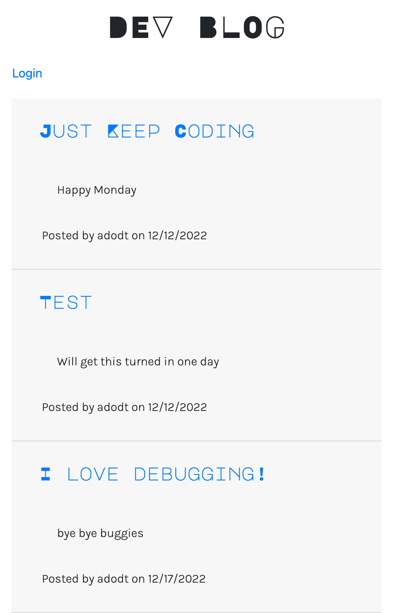

# DEV BLOG

 

## Description
The Dev Blog is a CMS style tech-blog site hosted on Heroku. It allows users to post interesting ideas and share their favorite tech news with others. 

 ## Table of Contents
- [Installation](#installation)
- [Heroku](#heroku)
- [Github Repository](#github-repo)
- [Usage](#usage)
- [Screenshot](#screenshot)
- [Tests](#tests)
- [License](#license)
- [Questions](#questions)

#
## Installation

If user would like to use locally, GitHub repo may be cloned. See link below to clone. If so, user will need to follow these steps to seed data and open app on localhost:3001:
#
1. In your CLI, enter npm install.
2. Enter "mysql -u root -p" and then enter your mysql password.
3. Enter "source db/schema.sql" and then quit mysql to your CLI.
4. Enter "npm run seed"
5. Enter "npm start" and navigate browser to localhost:3001

#
## Heroku App

#
Heroku link: [Tech-Link]

#
## GitHub Repository

You may clone this repo to begin using application: [GitHub Repo](https://github.com/adodt/dev_blog)

#
## Usage

User can sign up using username and password. Once a sign up is created, user can entry via log in. The user can create a new blog by going to the Dashboard page and clicking "new post". Once a post is created, user can go to the homepage to view all blog posts. User can update or delete an exisiting blog. 

#
## Screenshots

#### Homepage

 

#
## Tests

There are no tests for this application, all input data is validated for models.

#
## License

#### MIT License [vist link](https://choosealicense.com/licenses/mit/)
Copyright 2022 

Permission is hereby granted, free of charge, to any person obtaining a copy of this software and associated documentation files (the "Software"), to deal in the Software without restriction, including without limitation the rights to use, copy, modify, merge, publish, distribute, sublicense, and/or sell copies of the Software, and to permit persons to whom the Software is furnished to do so, subject to the following conditions:

The above copyright notice and this permission notice shall be included in all copies or substantial portions of the Software.

THE SOFTWARE IS PROVIDED "AS IS", WITHOUT WARRANTY OF ANY KIND, EXPRESS OR IMPLIED, INCLUDING BUT NOT LIMITED TO THE WARRANTIES OF MERCHANTABILITY, FITNESS FOR A PARTICULAR PURPOSE AND NONINFRINGEMENT. IN NO EVENT SHALL THE AUTHORS OR COPYRIGHT HOLDERS BE LIABLE FOR ANY CLAIM, DAMAGES OR OTHER LIABILITY, WHETHER IN AN ACTION OF CONTRACT, TORT OR OTHERWISE, ARISING FROM, OUT OF OR IN CONNECTION WITH THE SOFTWARE OR THE USE OR OTHER DEALINGS IN THE SOFTWARE.

#
## Questions

For any questions regarding this application or any other project by Alli Dodt:

### Email: [Gmail](mailto:allidodt@gmail.com)

### Gihub Profile: [Alli Dodt](https://github.com/adodt) 
